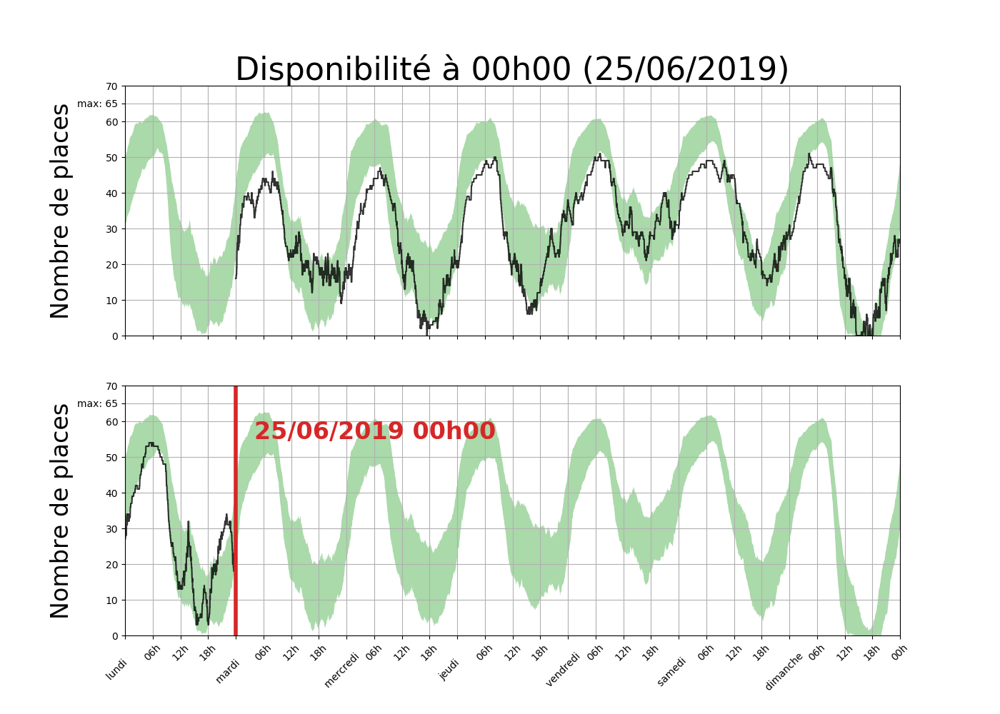
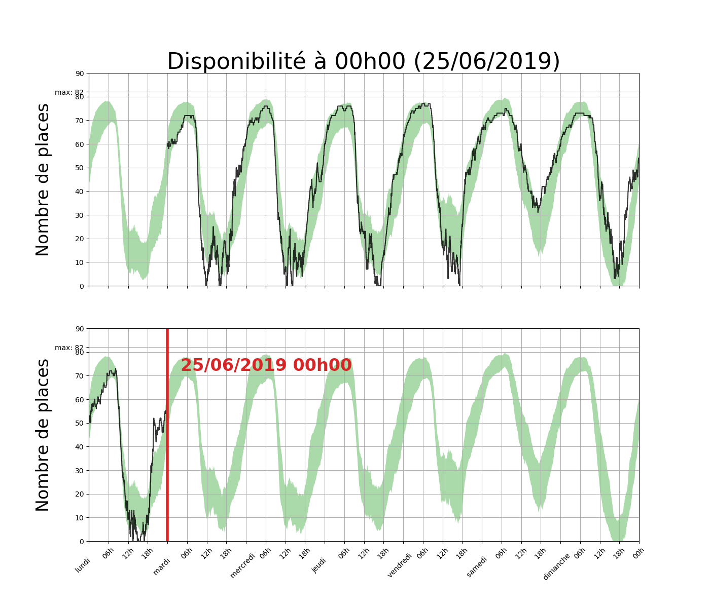

---
# Feel free to add content and custom Front Matter to this file.
# To modify the layout, see https://jekyllrb.com/docs/themes/#overriding-theme-defaults

layout: home
---

**Avertissement.**  
Ce site est une inititative personnelle et ne
dépend pas de [La Permanence](https://www.la-permanence.com). Les
informations sont données sans aucune garantie d'exactitute.  

---
 
**Explications.**
-  Les graphes sont mis à jour à minuit tous les jours.  
-  La courbe en noir correspond aux données des sept (7) derniers jours.  
-  Les données historiques (depuis janiver 2019) se concentrent dans la
zone verte.  
-  Les données sont disponibles [sur kaggle](https://www.kaggle.com/antoinechoffrut/la-permanence).

---
 
**Rue du Fer à Moulin**

---
 
**Rue d'Alésia**

